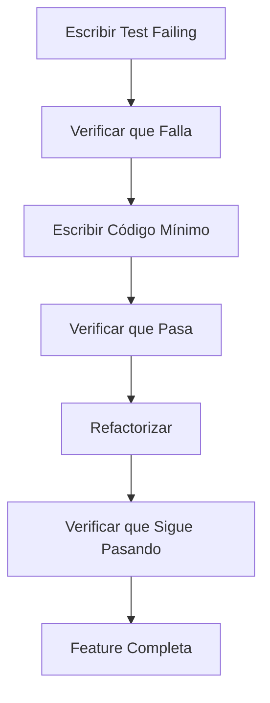

# 🧪 Estrategia de Testing - Gas Control System

## 📋 Resumen Ejecutivo

Este documento define la estrategia completa de testing para el sistema Gas Control, implementando **Test-Driven Development (TDD)** como metodología principal. La estrategia incluye testing unitario, de integración y end-to-end para garantizar la calidad y confiabilidad del sistema.

## 🎯 Objetivos de Testing

### **Objetivos Primarios**

- **Calidad**: Garantizar que todas las funcionalidades trabajen correctamente
- **Confiabilidad**: Prevenir regresiones y bugs en producción
- **Documentación**: Los tests sirven como documentación viva del comportamiento esperado
- **Desarrollo Ágil**: Facilitar refactoring y cambios seguros

### **Objetivos Secundarios**

- **Cobertura**: Alcanzar 80%+ de cobertura en código crítico
- **Performance**: Detectar problemas de rendimiento temprano
- **UX**: Validar experiencia de usuario en diferentes dispositivos
- **Accesibilidad**: Asegurar cumplimiento de estándares WCAG

## 🔄 Metodología TDD (Test-Driven Development)

### **Ciclo Red-Green-Refactor**

#### **🔴 Fase Red (Red Phase)**

1. **Escribir test fallido** que describe la funcionalidad deseada
2. **Verificar que falla** por la razón correcta (feature no implementada)
3. **El test documenta** el comportamiento esperado

```typescript
// Ejemplo: Test para validación de email
it('debe rechazar email inválido', () => {
  const result = loginSchema.safeParse({
    email: 'invalid-email',
    password: 'password123',
  });

  expect(result.success).toBe(false);
  expect(result.error.errors[0].message).toBe(
    'Por favor ingresa un email válido'
  );
});
```

#### **🟢 Fase Green (Green Phase)**

1. **Escribir código mínimo** para hacer pasar el test
2. **Enfocarse en hacer el test verde**, no en implementación perfecta
3. **Evitar over-engineering** en esta etapa

```typescript
// Implementación mínima para hacer pasar el test
const loginSchema = z.object({
  email: z.string().email('Por favor ingresa un email válido'),
  password: z.string().min(6, 'La contraseña debe tener al menos 6 caracteres'),
});
```

#### **🔵 Fase Refactor (Refactor Phase)**

1. **Mejorar calidad del código** manteniendo tests verdes
2. **Eliminar duplicación**, mejorar legibilidad, optimizar performance
3. **Asegurar que todos los tests sigan pasando**

```typescript
// Refactoring: Mejorar validación y mensajes
const loginSchema = z.object({
  email: z
    .string()
    .min(1, 'El email es requerido')
    .email('Por favor ingresa un email válido')
    .max(100, 'El email es demasiado largo'),
  password: z
    .string()
    .min(1, 'La contraseña es requerida')
    .min(6, 'La contraseña debe tener al menos 6 caracteres')
    .max(100, 'La contraseña es demasiado larga'),
});
```

## 🛠️ Herramientas de Testing

### **1. Jest - Unit & Integration Testing**

- **Propósito**: Testing de funciones, componentes y lógica de negocio
- **Configuración**: TypeScript, Testing Library, Coverage
- **Comandos**:
  ```bash
  npm test                    # Ejecutar todos los tests
  npm run test:watch         # Modo watch
  npm run test:coverage      # Con cobertura
  ```

### **2. Playwright - End-to-End Testing**

- **Propósito**: Testing de flujos completos de usuario
- **Navegadores**: Chrome, Firefox, Safari, Mobile
- **Comandos**:
  ```bash
  npm run test:e2e           # Ejecutar E2E tests
  npm run test:e2e:ui        # Interfaz visual
  npm run test:e2e:headed    # Con navegador visible
  npm run test:e2e:debug     # Modo debug
  ```

### **3. Testing Library - Component Testing**

- **Propósito**: Testing de componentes React con enfoque en UX
- **Filosofía**: Testear como el usuario interactúa, no implementación
- **Utilidades**: render, screen, userEvent, waitFor

## 📊 Estrategia por Tipo de Feature

### **🔐 Autenticación**

#### **Unit Tests**

- ✅ Validaciones Zod (email, contraseña, roles)
- ✅ Componentes de formulario (renderizado, validaciones)
- ✅ Utilidades de autenticación

#### **Integration Tests**

- ✅ Server actions (signUp, logIn, logOut)
- ✅ API endpoints y respuestas
- ✅ Manejo de errores y redirecciones

#### **E2E Tests**

- ✅ Flujo completo de registro
- ✅ Flujo completo de login
- ✅ Navegación entre formularios
- ✅ Manejo de errores end-to-end

### **📱 UI Components**

#### **Unit Tests**

- ✅ Renderizado correcto
- ✅ Interacciones de usuario
- ✅ Estados de carga y error
- ✅ Validaciones en tiempo real

#### **Integration Tests**

- ✅ Envío de formularios
- ✅ Navegación entre páginas
- ✅ Persistencia de datos

#### **E2E Tests**

- ✅ Responsive design
- ✅ Accesibilidad
- ✅ Cross-browser compatibility

### **💼 Business Logic**

#### **Unit Tests**

- ✅ Cálculos de inventario
- ✅ Procesamiento de transacciones
- ✅ Validaciones de negocio
- ✅ Transformaciones de datos

#### **Integration Tests**

- ✅ Operaciones de base de datos
- ✅ Actualizaciones en tiempo real
- ✅ Sincronización offline/online

#### **E2E Tests**

- ✅ Flujos completos de usuario
- ✅ Interacciones cross-feature
- ✅ Escenarios de error

## 📈 Requisitos de Cobertura

### **Cobertura por Tipo de Código**

| Tipo de Código        | Cobertura Mínima | Cobertura Objetivo |
| --------------------- | ---------------- | ------------------ |
| **Autenticación**     | 90%              | 95%                |
| **Lógica de Negocio** | 85%              | 90%                |
| **Componentes UI**    | 80%              | 85%                |
| **Utilidades**        | 95%              | 98%                |
| **Server Actions**    | 85%              | 90%                |

### **Métricas de Calidad**

- **Statements**: 80%+ en código crítico
- **Branches**: 75%+ en lógica condicional
- **Functions**: 85%+ en funciones públicas
- **Lines**: 80%+ en líneas ejecutables

## 🚀 Flujo de Trabajo TDD

### **1. Desarrollo de Nueva Feature**



### **2. Comandos de Desarrollo**

```bash
# 1. Red Phase - Escribir test fallido
npm test -- --watch

# 2. Green Phase - Implementar funcionalidad
npm run dev

# 3. Refactor Phase - Mejorar código
npm run test:coverage

# 4. E2E Testing - Validar flujo completo
npm run test:e2e
```

### **3. Checklist de Feature Completa**

- [ ] **Unit Tests**: Todas las funciones y componentes probados
- [ ] **Integration Tests**: Server actions y APIs probadas
- [ ] **E2E Tests**: Flujo completo de usuario probado
- [ ] **Coverage**: Cobertura mínima alcanzada
- [ ] **Cross-browser**: Funciona en Chrome, Firefox, Safari
- [ ] **Mobile**: Funciona en dispositivos móviles
- [ ] **Accessibility**: Cumple estándares WCAG
- [ ] **Performance**: Tiempos de respuesta aceptables

## 🔧 Configuración de Testing

### **Jest Configuration**

```javascript
// jest.config.js
module.exports = {
  testEnvironment: 'jsdom',
  setupFilesAfterEnv: ['<rootDir>/jest.setup.js'],
  moduleNameMapping: {
    '^@/(.*)$': '<rootDir>/$1',
  },
  collectCoverageFrom: [
    'components/**/*.{js,jsx,ts,tsx}',
    'lib/**/*.{js,jsx,ts,tsx}',
    'actions/**/*.{js,jsx,ts,tsx}',
  ],
};
```

### **Playwright Configuration**

```typescript
// playwright.config.ts
export default defineConfig({
  testDir: './e2e',
  fullyParallel: true,
  retries: process.env.CI ? 2 : 0,
  use: {
    baseURL: 'http://localhost:3000',
    trace: 'on-first-retry',
  },
  projects: [
    { name: 'chromium', use: { ...devices['Desktop Chrome'] } },
    { name: 'firefox', use: { ...devices['Desktop Firefox'] } },
    { name: 'webkit', use: { ...devices['Desktop Safari'] } },
  ],
});
```

## 📝 Convenciones de Testing

### **Naming Conventions**

```typescript
// Unit Tests
describe('loginSchema', () => {
  it('debe validar email y contraseña válidos', () => {});
  it('debe rechazar email inválido', () => {});
});

// Integration Tests
describe('Auth Actions', () => {
  describe('signUp', () => {
    it('debe crear usuario exitosamente', () => {});
  });
});

// E2E Tests
describe('Sistema de Autenticación - E2E', () => {
  describe('Flujo de Registro', () => {
    it('debe permitir registro completo de un jefe', () => {});
  });
});
```

### **Test Structure (AAA Pattern)**

```typescript
it('debe validar email inválido', () => {
  // Arrange - Preparar datos de prueba
  const invalidData = {
    email: 'invalid-email',
    password: 'password123',
  };

  // Act - Ejecutar la acción
  const result = loginSchema.safeParse(invalidData);

  // Assert - Verificar el resultado
  expect(result.success).toBe(false);
  expect(result.error.errors[0].message).toBe(
    'Por favor ingresa un email válido'
  );
});
```

### **Data Test IDs**

```typescript
// En componentes
<input data-testid="email-input" />
<button data-testid="submit-button">Iniciar Sesión</button>

// En tests
await page.fill('[data-testid="email-input"]', 'test@example.com');
await page.click('[data-testid="submit-button"]');
```

## 🚨 Manejo de Errores en Tests

### **Test Failures**

```typescript
// Bueno: Test específico y descriptivo
it('debe mostrar error cuando email es inválido', () => {
  // Test implementation
});

// Malo: Test genérico
it('debe funcionar', () => {
  // Test implementation
});
```

### **Async Testing**

```typescript
// Bueno: Usar waitFor para operaciones async
await waitFor(() => {
  expect(screen.getByText('Error message')).toBeInTheDocument();
});

// Malo: Usar setTimeout
setTimeout(() => {
  expect(screen.getByText('Error message')).toBeInTheDocument();
}, 1000);
```

### **Mocking**

```typescript
// Mock de funciones externas
jest.mock('@/actions/auth', () => ({
  signUp: jest.fn(),
  logIn: jest.fn(),
}));

// Mock de navegación
jest.mock('next/navigation', () => ({
  useRouter: () => ({ push: jest.fn() }),
  useSearchParams: () => new URLSearchParams(),
}));
```

## 📊 Reporting y Monitoreo

### **Coverage Reports**

```bash
# Generar reporte HTML
npm run test:coverage
# Abrir coverage/lcov-report/index.html
```

### **E2E Reports**

```bash
# Generar reporte HTML de Playwright
npm run test:e2e
# Abrir playwright-report/index.html
```

### **CI/CD Integration**

```yaml
# GitHub Actions
- name: Run Unit Tests
  run: npm run test:coverage

- name: Run E2E Tests
  run: npm run test:e2e

- name: Upload Coverage
  uses: codecov/codecov-action@v3
```

## 🎯 Próximos Pasos

### **Fase 1: Configuración Base** ✅

- [x] Jest configurado con TypeScript
- [x] **Playwright**: Pendiente - se implementará con MCP de VSCode
- [x] Scripts de testing en package.json
- [x] Documentación de testing

### **Fase 2: Tests de Autenticación** 🔄

- [x] Unit tests para validaciones
- [ ] Integration tests para server actions
- [ ] **E2E tests**: Pendiente - se implementará con MCP de VSCode
- [ ] Arreglar mocks de Jest

### **Fase 3: Tests de Business Logic** 📋

- [ ] Tests para cálculos de inventario
- [ ] Tests para procesamiento de transacciones
- [ ] Tests para validaciones de negocio

### **Fase 4: Tests de UI** 📋

- [ ] Tests para componentes de dashboard
- [ ] Tests para formularios de transacciones
- [ ] Tests para responsive design

### **Fase 5: CI/CD Integration** 📋

a de videos y- [ ] **GitHub Actions**: Pendiente - se configurará con Playwright

- [ ] Coverage gates
- [ ] Automated deployment

## 📚 Recursos Adicionales

### **Documentación**

- [Jest Documentation](https://jestjs.io/docs/getting-started)
- [Playwright Documentation](https://playwright.dev/docs/intro)
- [Testing Library Documentation](https://testing-library.com/docs/)

### **Best Practices**

- [Testing Best Practices](https://kentcdodds.com/blog/common-mistakes-with-react-testing-library)
- [TDD Best Practices](https://blog.cleancoder.com/uncle-bob/2014/12/17/TheCyclesOfTDD.html)
- [E2E Testing Best Practices](https://playwright.dev/docs/best-practices)

---

**Recuerda**: Los tests son una inversión en la calidad y mantenibilidad del código. Un buen test suite te permite refactorizar con confianza y detectar problemas antes de que lleguen a producción.
